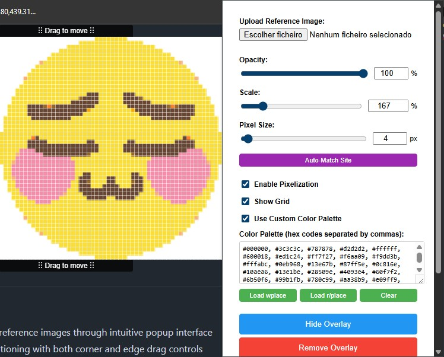

# Plastic Browser Extension

A browser extension that helps you create pixel art on websites like wplace.live by overlaying reference images with adjustable opacity and positioning.

## 📥 Download Now
**[⬇️ Install from Chrome Web Store](https://chromewebstore.google.com/detail/plastic/jmgohdfjidehbaggidpjikmccilopgpk)**

**Para usuários brasileiros**: Clique no link acima para instalar a extensão Plastic direto da Chrome Web Store. A extensão funciona perfeitamente no Chrome e Edge!

## Installation

### Chrome Web Store (Recommended)
Install directly from the Chrome Web Store: [Plastic Extension](https://chromewebstore.google.com/detail/plastic/jmgohdfjidehbaggidpjikmccilopgpk)

### Manual Installation
1. Open Chrome/Edge and navigate to `chrome://extensions/`
2. Enable "Developer mode" in the top right
3. Click "Load unpacked" and select this extension folder
4. The Plastic icon will appear in your extensions toolbar

## Features

### Core Functionality
- 🖼️ **Image Upload & Display**: Upload reference images through intuitive popup interface
- 🎛️ **Dual Drag Handles**: Precision positioning with both corner and edge drag controls
- 👁️ **Adjustable Opacity**: Fine-tune transparency (0-100%) for perfect overlay visibility
- 📏 **Scalable Overlay**: Resize from 10-200% to match any pixel grid size
- 🎨 **Customizable Color Palettes**: Built-in color palette support for consistent pixel art creation
- 🔍 **Auto-Pixel Detection**: Intelligent pixel grid detection for precise alignment

### Advanced Features
- 💾 **Persistent State**: All settings automatically saved across page reloads and sessions
- 🎯 **Precision Input Controls**: Numerical input fields for exact positioning and scaling
- 👀 **Quick Show/Hide Toggle**: Instantly toggle overlay visibility while maintaining position
- 🌐 **Universal Compatibility**: Optimized for wplace.live and works on any website with canvas elements or pixel art interfaces
- 🔒 **Privacy-First**: All image processing happens locally - no data transmission

## Usage

1. Navigate to a pixel art website (like wplace.live)
2. Click the Plastic extension icon
3. Upload a reference image using "Choose File"
4. Adjust opacity and scale as needed
5. The overlay will appear on the page with a drag handle
6. Position the overlay over the target area
7. Use "Hide Overlay" to temporarily hide while placing pixels
8. Use "Remove Overlay" to clear the current image

## Interface Controls

### Popup Controls
- **📁 File Upload**: Choose and upload reference images (supports all standard formats)
- **🎛️ Opacity Slider**: Fine-tune transparency (0% = invisible, 100% = opaque) 
- **📏 Scale Slider**: Resize overlay (10% = tiny, 200% = double size)
- **🎯 Precision Inputs**: Numerical fields for exact opacity and scale values
- **👁️ Show/Hide Toggle**: Instantly toggle overlay visibility without losing position
- **🗑️ Remove Button**: Clear current overlay and uploaded image
- **🎨 Color Palette**: Access customizable color palettes for pixel art creation

### Overlay Controls
- **🎛️ Dual Drag Handles**: Multiple drag points for precise positioning
- **📍 Position Persistence**: Overlay remembers exact placement across sessions
- **🔍 Auto-Alignment**: Smart pixel grid detection for perfect positioning

## Pro Tips

### Optimal Settings
- **🎯 Opacity Sweet Spot**: Use 30-70% opacity for the perfect visibility balance
- **📏 Grid Matching**: Scale your image to align perfectly with the target pixel grid
- **🎨 Color Workflow**: Use built-in color palettes to maintain consistent pixel art colors
- **🔍 Precision Mode**: Use numerical inputs for exact positioning when pixel-perfect accuracy is needed

### Best Practices  
- **📍 Position First**: Carefully position overlay before starting pixel placement
- **👁️ Hide When Needed**: Toggle overlay visibility when selecting colors or placing pixels
- **💾 Save Progress**: Take advantage of automatic state persistence across sessions
- **🎛️ Use Dual Handles**: Experiment with different drag handles for optimal positioning control

## Technical Specifications

### Browser Compatibility
- **Chrome 88+**: Full feature support
- **Edge 88+**: Full feature support  
- **Other Chromium-based browsers**: Compatible with Manifest V3 support

### Architecture
- **Manifest V3**: Latest extension standard for enhanced security
- **Programmatic Injection**: Dynamic script loading for optimal performance
- **Local Storage**: Client-side data persistence with no external dependencies
- **Cross-Site Compatible**: Works on any website through universal injection

### Security & Privacy
- **🔒 Local Processing**: All image processing happens on your device
- **🛡️ Minimal Permissions**: Only requests necessary permissions (activeTab, storage)
- **🔐 No Data Transmission**: Images and settings never leave your browser
- **✅ Secure Architecture**: Built following modern extension security best practices

## Support & Feedback

Found a bug or have a feature request? We'd love to hear from you!
- **Chrome Web Store**: Leave a review and rating
- **Issues**: Report bugs or request features through the extension popup
- **Community**: Share your pixel art creations and tips with other users

---

**Made with ❤️ for the pixel art community**